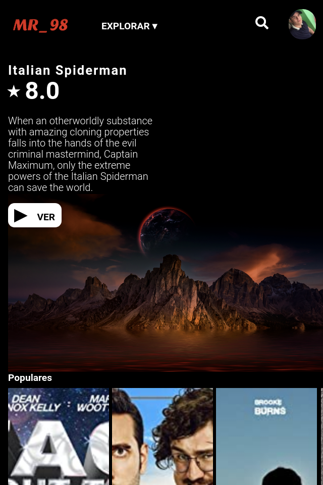

# MR_98 Movies

Simulando una aplicación de series, programas y películas, creada con Next Js, React y Firebase para la autenticación, es responsive first-mobile, css con styled-components, consumiendo la api pública de películas y series http://www.omdbapi.com/.

## Empezar 

* `yarn` instalar dependencias.
* `yarn run dev` para levantar entorno de desarrollo.
* `yarn run build` build para producción.
* `yarn start` observar en producción antes de hacer deploy.
* `yarn export` generar la carpeta out/.

## Licencia

MIT

## Sitio

https://mrmovie98.vercel.app
